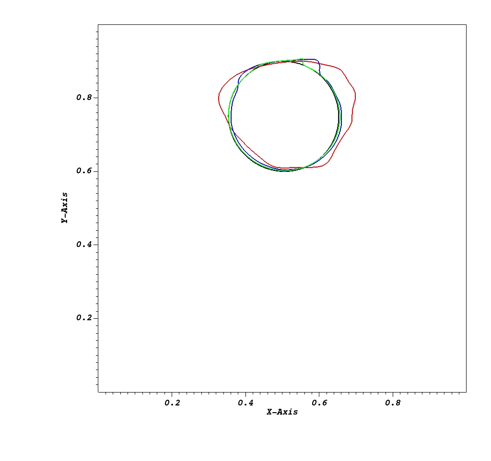
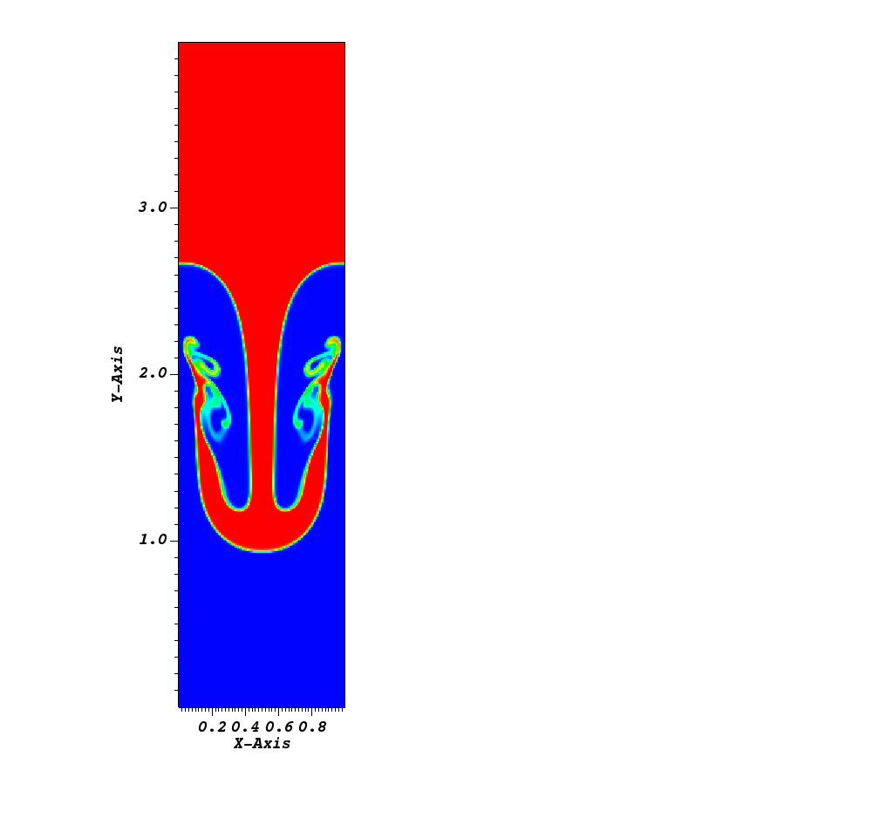
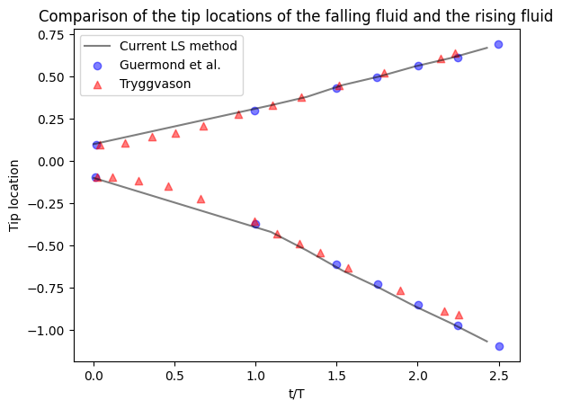

# IAMReX

This repo builds upon IAMR (https://amrex-codes.github.io/IAMR/) code that solves the multiphase incompressible flows. The Navier-Stokes euqations are solved on a semi-staggered grid using the projection method. The gas-liquid interface is captured using either the level set (LS) method or the convervative level set (CLS) method. The fluid-solid interface is resolved using the diffused immersed boundary method (DIBM). The particle-wall as well as the particle-particle collision are also captured by the adaptive collision
time model (ACTM). This code aims at simulating the multiphase flow and fluid structure interaction (FSI) problems on both CPUs and GPUs with/without subcycling.

## Features

- LS method and reinitialization schemes
- Diffused Immersed Boundary Method
- Particle Collision Algorithms

## Examples

- [Reversed Single Vortex (RSV)](./Tutorials/RSV/)

    
     
    <figcaption style="text-align:center;">Profiles of drop interface in the RSV problem at t/T=1 after one rotation. Black line: Analytical Solution; Red line: 64*64; Blue line: 128*128; Green line: 256*256</figcaption>
     
     

- [Rayleigh-Taylor (RT) instability](./Tutorials/RayleighTaylor_LS/)

    <!-- First Image -->
    

        
         
        <figcaption>Density profile at t/T=2.42 using IAMR convective scheme.</figcaption>
         
                 
    

    <!-- Second Image -->    
    

        
         
        <figcaption>Density profile at t/T=2.42 using LS method.</figcaption>
         
         
    

    <!-- Third Image -->    
    

        
         
        <figcaption>Comparison of the tip locations of the falling fluid and the rising fluid.</figcaption>
         
         
    

- [Breaking Wave](./Tutorials/BreakingWave_LS/)